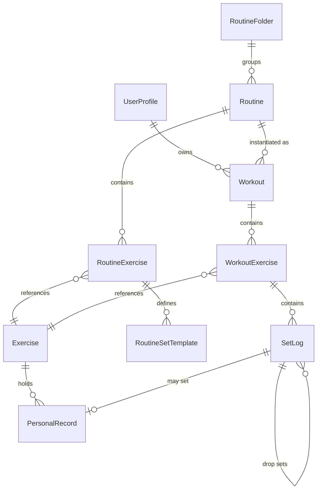

# Product Requirements Document — **Rerack** *(working name)*

> A free, local-first iOS strength-training logbook — and, as of this revision, cardio logbook too.
> **Version 0.6** · Author: Mudit · Date: 2026-08-08
> `Rerack` is the current working name — good enough to build under, not locked in. See **Appendix A** for how to keep it swappable and for the alternates on the bench.

---

## Changelog

### v0.5 → v0.6
| # | Change | Section |
|---|---|---|
| 1 | **Bug fixed: "No" on the superset prompt didn't reliably stick.** SwiftUI clears an alert's `isPresented` binding *before* running the tapped button's action, so the decline handler could find its state already nil and never record the refusal — meaning a declined pair could still be auto-grouped later. Pair identity is now held in state the binding doesn't touch. **"No" is now final for that pair, for the rest of the workout.** | §7.8.1 |
| 2 | **New §23 — exercise data & visual asset sourcing.** Honest provenance of the current catalogue (hand-written, not sourced), plus verified free options: **MuscleMap** (MIT, native SwiftUI, front/back male/female muscle highlighting with heatmaps, zero dependencies) and **free-exercise-db** (Unlicense/public domain, 800+ exercises with instructions and images). wger evaluated and **not** recommended — CC-BY-SA share-alike obligations when a public-domain alternative exists. | §23 |
| 3 | **§6.2 narrowed and §2.2 updated** — "never ship exercise media" was too strong. Now: out of scope M1–M10, **revisited at M11**. | §2.2, §6.2, §23.3 |

### v0.4 → v0.5
| # | Change | Section |
|---|---|---|
| 1 | **Superset model reframed** — grouping is now understood as primarily a *mid-workout* act, not a routine-editor one, with **auto-detection** from alternating behaviour. The pre-planned route stays, unchanged, but is no longer treated as the main path. | §7.8.1 |
| 2 | **Bug fixed:** the routine card's "Start Routine" button appeared broken. It was disabled (no active workout screen existed pre-M3) *and* the whole card had a tap gesture opening the editor, so every tap fell through to editing. Tapping the card or the button now starts the routine; **edit/duplicate/remove moved behind long-press**, per your request. | §9.3 |
| 3 | M3 built: active workout screen, ghost sets, tick-to-complete, live stats, wall-clock rest timer with superset suppression, cross-tab banner, crash recovery. | §7, §16 |

### v0.3 → v0.4
| # | Change | Section |
|---|---|---|
| 1 | **Cardio promoted from non-goal to a full 4th tab**, alongside Home/Workout/Profile — manual entry (with optional photo attach) is real and built; not a stub | §6, §21 |
| 2 | **§2.2 Non-Goals corrected** — cardio tracking was listed as explicitly out of scope in v0.1–v0.3; that line is removed, since it directly contradicted this request | §2.2 |
| 3 | **Dark mode / Appearance setting** (System / Light / Dark) added to Settings and implemented | §10.2 |
| 4 | **Muscle-group data flow clarified** — the 190-exercise catalogue already carries primary/secondary muscles; a picker only ever appears for a genuinely new custom exercise, never for anything in the library | §9.1 |
| 5 | **New §22 — on-device intelligence research**, answering directly: Vision framework OCR for reading a treadmill console (free, on-device, mature — but not tuned for LED/LCD segment displays, a real risk worth prototyping before committing UI to it) and Apple's Foundation Models framework for on-device weekly/monthly/yearly natural-language summaries (free, offline, no per-token cost — but hardware-gated to iPhone 15 Pro/16-series+/17-series and Apple silicon iPad/Mac, so a non-AI fallback is mandatory, not optional) | §22 |
| 6 | Both of the above are **research-and-design notes for a future milestone**, not built now — manual cardio entry does not wait on either | §21, §22 |

### v0.2 → v0.3
| # | Change | Section |
|---|---|---|
| 1 | Working name set to **Rerack**; app identity kept swappable by design | Appendix A |
| 2 | Q7 (duration) **finalised, no longer a recommendation** — pure wall-clock, gym-arrival-to-gym-departure, no pause, no auto-detect. Both alternatives explicitly rejected. | §18 |
| 3 | Q8 (RPE) clarified — it is **always a manual, subjective self-report**. The app cannot infer it from training data; there's no biometric proxy (sleep, HRV) in scope. | §18 |
| 4 | Appendix A.3 updated with your own read on Knurl's UI, and folded into the product principle it reinforces | Appendix A.3, §4 |

### v0.1 → v0.2
| # | Change | Section |
|---|---|---|
| 1 | **Supersets and drop sets** promoted to V1 with a full spec | §7.8, §7.9 |
| 2 | **Live Activity / Dynamic Island / Notification Center** promoted to V1 with a full design spec | §8 |
| 3 | **Backend recommendation changed** from Supabase → CloudKit + Cloudflare, with reasoning | §12.5 |
| 4 | **"What's this?" explainer system** added as a first-class feature | §10.6 |
| 5 | **Onboarding flow** added; dominant-hand setting now asked up front and reversible | §10.1 |
| 6 | **Workout-completion photo** moved to V1 and placed at the top of the summary | §9.3 |
| 7 | **Exercise demo images/video** cut entirely — not deferred, removed from the product | §6.2 |
| 8 | **Bodyweight exercises** now use Apple Health bodyweight in volume maths | §13.1 |
| 9 | Q1 confirmed — set row is `Set │ Previous │ kg │ reps │ ✓` | §7.2 |
| 10 | Q2 resolved — multi-tag chips on the summary screen | §9.3 |
| 11 | Q7 (duration) and Q8 (RPE) explained in full, with recommendations | §18 |
| 12 | Build plan and TestFlight expectations revised for the larger V1 | §16 |
| 13 | Name candidates researched for availability | Appendix A |

---

## 1. Problem & Motivation

Hevy and its peers gate the parts you actually use behind a subscription. You already know what you want to track, and it is not complicated: weight, reps, sets, over time, per exercise, per routine.

The goal is **not** to clone Hevy feature-for-feature. It is to build the ~15% of Hevy that you use 100% of the time, own the data outright, and pay nothing recurring.

**The recurring cost of this product must be $0.** You already hold an Apple Developer account, so distribution is solved. Every architecture decision in §12 is made under the zero-recurring-cost constraint.

### 1.1 Core insight

The app is a **paper logbook that does arithmetic.** The single most valuable feature is that when you walk up to the machine, the app already shows you what you did last time. Everything else — graphs, PRs, share cards, animals — is decoration on top of that one job.

### 1.2 Second insight (new in v0.2)

With the Live Activity spec in §8, the app's centre of gravity moves off the app screen entirely. The best version of this product is one where, mid-workout, **you never unlock your phone.** You glance at the Dynamic Island, see your target, tap a tick, and the rest timer takes over. Opening the app becomes the exception — for editing a number that didn't go to plan — not the rule.

This should drive design tie-breaks throughout: if a feature can live on the Lock Screen, it should.

---

## 2. Goals & Non-Goals

### 2.1 Goals

| # | Goal | Success looks like |
|---|---|---|
| G1 | Log a set in under 2 seconds without looking hard at the screen | Tap weight → type → tap reps → type → tap ✓ |
| G2 | Never make the user remember last session's numbers | Every set row pre-filled with last session's values as editable ghost text |
| G3 | Zero recurring cost | No paid backend, ever. See §12.6. |
| G4 | Data is yours and portable | One-tap full CSV export of every set ever logged |
| G5 | Rest is managed for you | Timer auto-starts, survives lock, and lives on the Dynamic Island |
| G6 | Never unlock the phone mid-workout | A full set can be logged from the Lock Screen |
| G7 | Nothing in the app is unexplained jargon | Every computed metric has a `?` that explains itself in plain English |
| G8 | Time-efficient training is first-class | Supersets and drop sets work properly, not as an afterthought |

### 2.2 Non-Goals

- Nutrition, macros, calorie tracking
- Coaching, program generation, AI recommendations, auto-progression
- Apple Watch app (V1–V2; strong candidate for V3)
- iPad-optimised layout (must not crash, need not be beautiful)
- Android
- **Exercise demonstration images or videos — out of scope for M1–M10; revisited at M11** (§6.2, §23.3)
- Monetisation of any kind

---

## 3. Users

**Primary (and for V1, only) user: you.** Solo lifter, machine and free-weight mix, repeatable weekly split, frequently short on time — hence heavy use of supersets and drop sets.

**Secondary [V2]: 5–20 beta testers.** They introduce the requirements V1 gets to ignore: accounts, a server, a privacy model, and a social graph.

---

## 4. Product Principles

1. **The active-workout screen is sacred.** No feature ships there unless it survives the "chalky hands, mid-set, out of breath" test.
2. **The Lock Screen is the primary surface.** See §1.2.
3. **Nothing is mandatory.** Every field except weight and reps is optional.
4. **Never lose a set.** State is written to disk on every mutation, not on workout completion.
5. **Grey means suggestion, black means fact.** Ghost values are visually distinct from logged values everywhere, with no exceptions.
6. **No unexplained jargon.** If the app shows a number you'd have to Google, it ships with a `?`.
7. **Free means free.** No feature requires a paid tier of any third-party service at expected scale.
8. **A logbook, not a coach.** The app never tells you what to lift, how to feel about a session, or what to do next — it records what happened and gets out of the way. This is a direct, deliberate contrast with how you described Knurl's UI (cluttered, framed as a coaching app) after looking at it — see Appendix A.3. Every screen in this document should be checkable against this line: does it *record*, or has it started to *advise*? Only the former is in scope for V1 or V2.

---

## 5. Release Plan

### V1 — "Just me" (local-only, feature-complete)
No accounts, no network, no server. All data on device. **This is now a substantially larger V1 than v0.1 proposed** — it includes supersets, drop sets, and the full Live Activity system.

### V2 — "Beta" (accounts + social)
Backend introduced. Accounts, cross-device sync, following, shared workout links. Local-first remains the storage model; the server is a sync and sharing layer, never the source of truth.

### 5.1 Feature matrix

| Feature | V1 | V2 |
|---|:--:|:--:|
| Exercise library (built-in + custom) | ✅ | |
| Routines: create, edit, reorder, folders | ✅ | |
| Active workout + tick-to-complete | ✅ | |
| Ghost sets from last session | ✅ | |
| Swipe to approve / delete set | ✅ | |
| **Supersets** | ✅ | |
| **Drop sets** | ✅ | |
| Rest timer + local notification | ✅ | |
| **Live Activity: Dynamic Island** | ✅ | |
| **Live Activity: Lock Screen / Notification Center** | ✅ | |
| **Log a set from the Live Activity** | ✅ | |
| Exercise detail: Summary + History | ✅ | |
| Exercise detail: How To ("Coming Soon" stub) | ✅ | |
| Progress graph with 5 metric filters | ✅ | |
| Personal records (4 types) | ✅ | |
| **"What's this?" explainer system** | ✅ | |
| **Onboarding flow** | ✅ | |
| Workout summary on finish | ✅ | |
| **Workout completion photo** | ✅ | |
| Routine baseline auto-update | ✅ | |
| Apple Health — read bodyweight & body fat | ✅ | |
| **Apple Health — bodyweight in volume maths** | ✅ | |
| Apple Health — write workout session | ✅ | |
| CSV export (full history) | ✅ | |
| Share card — text + animal variants | ✅ | |
| Share card — muscle-map figure | ✅ | |
| Profile: stats, calendar, measures dashboard | ✅ | |
| Accounts / auth | | ✅ |
| Cross-device sync | | ✅ |
| Follow users, home feed | | ✅ |
| Public workout links (web) | | ✅ |
| Exercise demo video / images | ❌ removed | ❌ |
| **Cardio tab — manual entry (all activity types)** | ✅ | |
| **Cardio — optional photo attach (visual record only)** | ✅ | |
| **Appearance setting (System/Light/Dark)** | ✅ | |
| **Cardio — Apple Health sync (read + write)** | | ✅ |
| **Cardio — photo → auto-filled numbers (on-device OCR)** | | *research spike, §22* |
| **Weekly/monthly/yearly AI check-ins (on-device)** | | *research spike, §22* |

---

## 6. Information Architecture

**Four-tab bottom bar** — Home, Workout, Cardio, Profile. Nothing else at root level.

⚠️ **Changed in v0.4:** this was a three-tab bar through v0.3, with cardio explicitly out of scope (§2.2 listed it as a non-goal). Cardio is now a peer of Workout, not nested inside it — a treadmill session and a bench-press session have almost nothing in common structurally (no sets, no reps, no superset/drop-set logic), so forcing them into one tab and one data model would have made both worse. See §21.

```
┌───────────────────┬───────────────────┬──────────────────┬───────────────────┐
│  HOME              │  WORKOUT          │  CARDIO           │  PROFILE          │
├────────────────────┼────────────────────┼──────────────────┼───────────────────┤
│ Recent workouts    │ ▶ Start Empty      │ + Log Cardio      │ Header: name,     │
│  (your log)        │   Workout          │                   │  username, totals │
│                    │                    │ Session list:     │                   │
│ [V2] Friends'      │ Routines           │  activity icon,   │ Activity graph    │
│  workout feed      │  └ Folders         │  duration,        │  (duration/vol/   │
│                    │  └ Routine cards   │  distance,        │   reps per day)   │
│                    │    [Start] [Edit]  │  calories, date    │                   │
│                    │                    │                   │ Dashboard tiles:  │
│                    │ + New Routine      │ (manual entry;     │  Statistics       │
│                    │                    │  optional photo    │  Exercises        │
│                    │ Exercise Library   │  attach, §21)       │  Measures         │
│                    │                    │                   │  Calendar         │
│                    │                    │                   │                   │
│                    │                    │                   │ Workout log list  │
└────────────────────┴───────────────────┴──────────────────┴───────────────────┘
                            │
                    (modal, full-screen)
                            ▼
                  ACTIVE WORKOUT SCREEN ⇄ LIVE ACTIVITY (§8)
                            │
                            ▼
                  WORKOUT SUMMARY → SHARE → Done
```

The **Active Workout** screen is a full-screen cover, not a tab. While a workout is live, a persistent banner appears above the tab bar on every tab. You cannot start a second workout while one is live. Cardio sessions have no equivalent live banner in V1 — they're logged after the fact (§21), not tracked start-to-finish the way a strength workout is.

### 6.1 First-run

New users see the onboarding flow (§10.1) before the tab bar.

### 6.2 A note on exercise media — removed, not deferred

⚠️ **Narrowed in v0.6.** This section previously read "the app will never ship exercise media." That was too strong — your clarification was that it applied to *current builds*, not to the product forever: *"for later versions it would be really great to have them added, M11 type."*

**The rule now:** no exercise demonstration images or videos through **M1–M10**. The burden that motivated the original decision (sourcing, licensing, and hosting media for 200+ exercises) turned out to be largely solved by public-domain sources — see **§23** for the research. Revisit at **M11** with MuscleMap (MIT) for anatomy graphics and free-exercise-db (public domain) for instruction text and images.

Consequences, applied throughout this document:
- The Exercise Detail header starts at the exercise name. No image, no frame, no reserved space.
- The **How To** tab still ships as the "Coming Soon" stub you originally asked for, but it will be filled with **text form cues**, not video, if it is ever filled at all.
- `Exercise.videoURL` is removed from the schema.

The one photo that *does* exist in the app is the workout-completion photo (§9.3) — a single user-taken image per workout. That is cheap, requires no content pipeline, and is promoted to V1.

---

## 7. Feature Spec — Active Workout

### 7.1 Screen anatomy

```
╔═══════════════════════════════════════════════════════════╗
║  ✕                  Push Day A                    Finish  ║
║              00:24:11  ·  4,280 kg  ·  12 sets            ║
╠═══════════════════════════════════════════════════════════╣
║                                                           ║
║  ┌─────────────────────────────────────────────────────┐ ║
║  │ Seated Cable Row                              ···   │ ║
║  │ Rest: 3:00 ⏱                                        │ ║
║  ├─────────────────────────────────────────────────────┤ ║
║  │ SET   PREVIOUS      KG        REPS            ✓     │ ║
║  │  1    10 × 6      [ 10 ]     [ 6 ]           [✓]    │ ║
║  │  2    10 × 6      [ 12 ]     [ 6 ]           [ ]    │ ║
║  │  3    12 × 5      ⟨ 12 ⟩     ⟨ 5 ⟩           [ ]    │ ║
║  │              + Add Set                              │ ║
║  └─────────────────────────────────────────────────────┘ ║
║                                                           ║
║  ┃┌────────────────────────────────────────────────────┐ ║  ← superset
║  ┃│ A1  Incline DB Press                         ···   │ ║     (§7.8)
║  ┃│ ...                                                │ ║
║  ┃├────────────────────────────────────────────────────┤ ║
║  ┃│ A2  Cable Fly                                ···   │ ║
║  ┃│ ...                                                │ ║
║  ┃└────────────────────────────────────────────────────┘ ║
║                                                           ║
║            + Add Exercise                                 ║
╚═══════════════════════════════════════════════════════════╝
```

### 7.2 The set row — **confirmed layout**

Five columns, fixed order, left to right. This is confirmed per your Q1 answer.

| Column | Width | Content | Interaction |
|---|---|---|---|
| **Set #** | 32pt | `1`, `2`, `3` … / `W` warm-up / `D` drop | Tap → set-type menu |
| **Previous** | flex | `10 × 6` — what you did for this set index last time | Tap → fills kg + reps with these values |
| **kg** | 64pt | Numeric field | Tap → decimal keypad, 0.5 increments |
| **reps** | 56pt | Numeric field | Tap → number pad, integers |
| **✓** | 44pt | Tick button, **trailing edge by default** | Tap → complete set |

**Tick behaviour:**
1. Row animates to green (200ms), tick fills solid, haptic `.success`.
2. Values commit to the database immediately.
3. Keyboard dismisses.
4. Rest timer starts (§7.5) — *unless* this set is inside a superset or has pending drop sets (§7.8, §7.9).
5. Next incomplete row becomes active and scrolls into comfortable view.
6. PR badge 🏆 appears inline if applicable. No modal.
7. **Live Activity advances to the next state** (§8.4).

**Un-ticking:** tapping a green ✓ reverts the set, un-commits it, cancels the rest timer if that set started it. No confirmation.

**Validation:** a set cannot be completed with empty reps. Empty kg is allowed and stored as `0` — which, combined with §13.1, makes bodyweight exercises work correctly rather than logging zero volume.

### 7.3 Ghost sets

A *ghost set* is a row pre-populated with values from your last performance of that exercise, rendered grey (`.secondary`, ~45% opacity), not yet in the database.

**Source priority:**
1. Same exercise + same set index from your **most recent completed workout containing that exercise**, regardless of routine.
2. If that workout had fewer sets, fall back to its **last set** of that exercise.
3. If never performed, fall back to the **routine's target values**.
4. Otherwise empty.

The **Previous** column and the ghost values come from the same source, so they always agree.

> ⚠️ **Ghost pre-selection was never built and was fixed on 2026-08-18.** Tapping a ghost and typing appended instead of replacing — `0` + `60` gave `600`, and the set logged at 600 kg. The field now clears on focus and restores the suggestion if you leave without typing.

**Interactions:**

| Gesture | Result |
|---|---|
| **Tap ✓** | Accept ghost values as shown, complete the set. One tap. |
| **Swipe right →** | Same as ✓. Green flash from the leading edge. |
| **Swipe left ←** | Delete the row. Red, trash icon. Subsequent sets renumber. |
| **Tap kg / reps** | Ghost becomes editable, pre-selected so typing replaces it. Turns black on first keystroke. |

Full-swipe enabled both directions. Deleting shows a 4-second `Set deleted · UNDO` toast.

> ✅ **Met as of 2026-08-18**, via `SwipeActionRow` rather than `.swipeActions`. Swipe left reveals Drop + Delete; swipe right appends a set carrying this row's values. `.swipeActions` is honoured on `List` rows only and was inert here for the whole of V1 — the replacement drives the row from a `UIPanGestureRecognizer` installed on the enclosing scroll view, gated to horizontal movement inside the row's bounds, because a SwiftUI `DragGesture` loses the arena to the row's own text fields. Full-swipe, rubber-banding, one-open-row and VoiceOver actions are all reproduced. The 4-second `Set deleted · UNDO` toast is **still not built**.

**`+ Add Set`** appends a row pre-filled from the *last completed set of that exercise in this session* — not the historical ghost — because the likely intent is "one more like that."

### 7.4 Exercise card actions (`···`)

Add note · Reorder · Replace exercise · Remove · Set rest timer · **Add to superset** · **Add drop set to last set**

> ⚠️ **Partially built as of 2026-08-18.** The menu now ships Set Rest Timer, Plate Calculator, Add to Superset, Remove from Superset, **Add Drop Set to Last Set**, **Delete Last Set** and Remove Exercise. The two additions are permanent failsafes, not a stopgap: a swipe is invisible until you already know it exists, so every row action must also be reachable from the menu. Add note, Reorder and Replace exercise remain unbuilt.

### 7.5 Rest timer

**Configuration hierarchy** (most specific wins):
1. Per-exercise-in-this-workout override
2. Per-exercise default (saved to the exercise)
3. Global default — **3:00**, editable in Settings

Picker: wheel from `0:05` to `10:00` in 5s steps, plus chips `0:30 · 1:00 · 1:30 · 2:00 · 3:00 · 5:00`. Your 20-second case is one scroll or one tap away.

**Behaviour:**
- Starts automatically on tick. No "start rest" button.
- **Suppressed** between superset members and between a set and its drop sets — fires only when the round is genuinely over (§7.8, §7.9).
- Progress bar pinned above the safe area, counting **down**.
- Tap → full timer sheet with `−15s`, `+15s`, `Skip`, and the next set's target.
- Ticking a new set restarts the timer; it does not stack.
- **Wall-clock based.** Computed from a stored `restStartedAt` timestamp so backgrounding, lock, or app termination cannot cause drift.

**On completion:**
- Haptic + optional sound (Settings, default on)
- Live Activity switches to the "ready" state (§8.4)
- Local notification if backgrounded:
  > **Rest complete — 3:00**
  > Next: Seated Cable Row · Set 3 · 12 kg × 5
- In-app banner for 4 seconds if foregrounded

**Permissions:** notification permission requested the first time a rest timer completes with the app backgrounded, with a one-line explanation. Live Activities require a separate, less intrusive permission requested at first workout start.

### 7.6 Live session stats

- **Duration** — `HH:MM:SS` from `startedAt`, total elapsed wall-clock. See §18 Q7 for the full explanation and options.
- **Volume** — Σ effective load × reps over completed sets. Warm-ups excluded by default.
- **Sets** — completed set count.

### 7.7 Workout lifecycle & recovery

- Starting a routine creates a `Workout` with `startedAt = now` immediately. Everything after is an incremental save.
- **Crash recovery:** on launch, if a `Workout` has `endedAt == nil`, restore it and return to the active screen with a `Workout restored` toast. The Live Activity is also restored.
- **Abandoned workouts:** if a live workout is >12h old on launch, prompt `Finish it` (backdated to the last completed set, so duration stays honest) or `Discard`.
- **Discard** requires confirmation and deletes the workout and its sets permanently.

### 7.8 Supersets — **new in V1**

A **superset** is two or more exercises performed back-to-back with no rest between them, resting only after the last one. Given you train short on time, this is a primary feature, not a nicety.

**Data model:** `supersetGroup: String?` on both `RoutineExercise` and `WorkoutExercise`. Exercises sharing a group label (`"A"`, `"B"`, …) form a superset. Order within the group follows `orderIndex`.

**Creating a superset — three routes, deliberately** *(revised v0.5)*:
1. *In the routine editor (pre-planned):* exercise `···` → `Group With…` → pick the partner. Auto-assigns the next free letter.
2. *Mid-workout (explicit):* same `···` → `Add to Superset` on the active workout screen. **This is the primary route in practice** — see §7.8.1.
3. *Mid-workout (auto-detected):* the app notices you alternating and offers to group them for you — §7.8.1.

- *Breaking one:* `···` → `Remove from Superset`. If only one member remains, the group dissolves automatically.

#### 7.8.1 Why grouping is mostly a mid-workout act — and why it auto-detects

⚠️ **Revised in v0.5, based on how you actually train.** v0.2–v0.4 assumed supersets were declared upfront in the routine editor. Your correction: *"supersetting is something I decide when I'm working out instead of beforehand,"* and — more pointedly — *"picking an exercise and classifying it as a superset does a lot of nothing"* if all it buys is a visual label.

That critique is correct, and it reframes what the grouping is **for**. Grouping is not decoration; it earns its place only because it changes two real behaviours:

| What grouping actually buys | Where it matters |
|---|---|
| **Rest suppression** — no timer between A1 and A2, only after the round | §7.5, built |
| **"What's next" on the Live Activity** — the Lock Screen can say *"next: A2 Cable Fly, then back to A1"* instead of assuming you finish an exercise before moving on | §8.4, M6 |

The second one is the real payoff, and it's why grouping is worth capturing *at all* rather than just letting you log sets in any order. The app can't tell the Lock Screen what's coming next unless it knows the two exercises are a pair.

**Auto-detection rules (built in M3):**

1. You complete a set on exercise **A**, then complete a set on exercise **B** without finishing A (A has known expected sets remaining — from history or a routine target).
2. First time this happens for that pair → a single, dismissible prompt: **"Superset? Group these two so rest is skipped between them."**
3. **Yes** → grouped immediately. **No** → that pair is never asked about again for the rest of this workout.
4. If you're not asked (or the prompt is dismissed by tapping away) and the **same alternation happens a second time**, the pair is grouped automatically with no further prompting — the behaviour has spoken for itself by then.
5. Detection only ever looks at pairs that are **currently ungrouped**. Anything pre-planned or explicitly grouped is left alone.
6. If there's no expected set count to judge against (a brand-new exercise, no history, no routine target), detection stays silent rather than guessing.

**On keeping the routine-editor route** — you said *"I think the option to add a routine as a superset is useful. Don't fully remove it, but I personally am not gonna use it that way."* Kept, unchanged. It costs nothing to maintain (identical code path, see `SupersetGrouping.swift`) and it's genuinely the right tool for someone whose split is fixed.

**Detection state is intentionally not persisted.** The "asked already / declined already" bookkeeping lives in memory for the duration of the workout only. It's a nudge, not data — losing it to a force-quit costs nothing, and persisting it would mean migrating a table for a feature whose entire job is to be unobtrusive.

**Visual treatment:**
- Members render as one visually-joined card stack with a **coloured vertical bar** down the leading edge.
- Each member is labelled `A1`, `A2`, `A3` in the card header.
- The group carries a single rest setting, shown once on the last member.

**Execution order (round-robin):**
```
Round 1:  A1 set 1  →  A2 set 1  →  REST
Round 2:  A1 set 2  →  A2 set 2  →  REST
Round 3:  A1 set 3  →  A2 set 3  →  REST
```

The "next set" pointer — which drives both the auto-scroll and the Live Activity — follows this order, not top-to-bottom. This is the entire point of the feature and the part most likely to be got wrong.

**Rest timer rule:** ticking `A1 set 1` starts **no** timer. Ticking `A2 set 1` (the last member of the round) starts the timer. If members have different set counts, a member that has run out of sets is skipped in subsequent rounds, and the last *remaining* member of the round triggers rest.

**Optional intra-superset rest:** a per-group setting `Rest between exercises` (default `0:00`). Some people want 15–20s to walk between machines. When non-zero, a short timer fires between members and a distinct, quieter haptic is used.

**CSV:** exported as `superset_group` and `superset_position` columns.

### 7.9 Drop sets — **new in V1**

A **drop set** is a continuation of a set at reduced weight, performed immediately with no rest, taken to or near failure.

**Data model:** `SetLog.parentSetID: UUID?`. A drop set is a child of a normal set. Multiple drops can chain off one parent.

**UI:**
```
│  3    12 × 5      [ 14 ]     [ 5 ]           [✓]    │
│  └ D              [ 10 ]     [ 8 ]           [✓]    │   ← indented, "D"
│  └ D              [  7 ]     [ 6 ]           [ ]    │
```
Child rows are indented, marked `D`, and visually tethered to the parent with a small connector.

**Creating:** swipe on a completed set → `+ Drop`, or `···` → `Add drop set`. The new row pre-fills at **−20% of the parent's weight**, rounded to the nearest 2.5 kg, which is the usual default and saves a calculation mid-set.

**Rest timer rule:** no rest between a parent and its drops, and none between consecutive drops. The timer fires only when the **last drop in the chain** is ticked.

**Maths:**
- Volume: drops count fully, like any other set
- **Heaviest Weight PR**: uses the parent (top) set only — a drop is by definition lighter
- **Best Set Volume PR**: each set in the chain evaluated individually
- **Best 1RM**: drops are excluded, since a fatigued drop set produces a meaningless estimate
- Ghost sets reproduce the full drop chain next session

**CSV:** `set_type = drop`, plus `parent_set_index` and `drop_position`.

> ✅ **Working and verified end to end as of 2026-08-18.** Creation was unreachable for the whole of V1 — the only `addDrop` call sites went through `SetRowView`'s inert `.swipeActions`, and the `···` entry §7.4 promises was never built — so nothing downstream had ever run. Both routes now exist. Verified on the simulator and against `ZSETLOG`: the row pre-fills at −20% rounded to 2.5 kg, persists as `set_type = drop` with a `parentSetID`, counts fully toward volume, suppresses rest while the chain is open, and reproduces as an un-ticked row the next session the parent is ticked.

---

## 8. Live Activity — Dynamic Island, Lock Screen & Notification Center — **new in V1**

This is the feature that makes the product genuinely better than what you're replacing. It gets its own section.

### 8.1 Goal

Log an entire workout without unlocking your phone. Glance, tap, rest, repeat.

### 8.2 Platform constraints (real, verified)

These shape the design and are not negotiable:

| Constraint | Consequence for us |
|---|---|
| Live Activities support **`Button` and `Toggle` only** — via App Intents. **No text fields, no steppers, no sliders.** | You can *confirm* a set from the island, but you cannot *type a new weight* there. Design accordingly — see §8.5. |
| Intents must conform to **`LiveActivityIntent`** and be shared between app and widget extension | Architectural note for the build: intents live in a shared framework target. |
| Update pushes are **throttled** (roughly every few seconds), and a rapidly-updating countdown would blow the budget | The rest countdown must use SwiftUI's native `Text(timerInterval:countsDown:)`, which renders and decrements **on-device with zero updates**. This is the single most important implementation detail in this section. |
| Live Activities go stale after ~8h and are force-ended at ~12h | Matches the abandoned-workout rule in §7.7. Acceptable. |
| Interactive buttons require **iOS 17+** | We already target iOS 17+. No conflict. |
| The activity is dismissed if the user swipes it away | The app must handle "activity gone but workout still live" and offer to restart it from the in-app banner. |

### 8.3 Layouts

**Dynamic Island — Compact** (default, sharing the notch)

```
      ╭───────────────────────────────╮
      │ ⬤ 3/4                  1:42   │
      ╰───────────────────────────────╯
        ↑ leading:              ↑ trailing:
        set position            rest countdown, or "GO" when ready
```

**Dynamic Island — Minimal** (another activity is also running)

A single glyph: a filled ring showing rest progress, or a dot when ready to lift.

**Dynamic Island — Expanded** (long-press) — *Logging state*

```
╭─────────────────────────────────────────────╮
│  PUSH DAY A                          A1▸A2  │  ← routine · superset indicator
│                                             │
│  Seated Cable Row                           │  ← current exercise
│  Set 3 of 4                                 │
│                                             │
│        12 kg  ×  6 reps            ┌─────┐  │  ← target (ghost values)
│                                    │  ✓  │  │  ← LiveActivityIntent button
│                                    └─────┘  │
╰─────────────────────────────────────────────╯
```

**Dynamic Island — Expanded** — *Resting state*

```
╭─────────────────────────────────────────────╮
│  RESTING                             1:42   │
│  ▓▓▓▓▓▓▓▓▓▓▓░░░░░░░░░░░░░░░░░░░░░░░░░░░░   │
│                                             │
│  Next:  Lat Pulldown · Set 1                │
│         40 kg × 10                          │
│                                             │
│   [ −15s ]      [ Skip ]      [ +15s ]      │
╰─────────────────────────────────────────────╯
```

**Lock Screen / Notification Center banner**

Same content, taller, full width. This is the surface that matters on non-notch iPhones and it must be designed as a first-class layout, not a squeezed variant.

```
┌───────────────────────────────────────────────────┐
│  🏋  PUSH DAY A                          24:11    │
│                                                   │
│  Seated Cable Row                    Set 3 of 4   │
│  ──────────────────────────────────────────────   │
│                                                   │
│       12 kg  ×  6 reps                ┌────────┐  │
│       ⟨ same as last time ⟩           │   ✓    │  │
│                                       └────────┘  │
│                                                   │
│  Up next:  Lat Pulldown · 40 kg × 10              │
└───────────────────────────────────────────────────┘
```

Every element you specified is present: routine at the top, current exercise, set number, target reps and weight, and a tick to complete.

### 8.4 State machine

```
        ┌──────────────────────────────────────────┐
        │                                          │
        ▼                                          │
   ┌─────────┐   tap ✓    ┌──────────┐  timer end  │
   │ LOGGING │──────────▶ │ RESTING  │─────────────┘
   │         │            │          │  or Skip
   └─────────┘            └──────────┘
        │                      │
        │ (superset member,    │ advance pointer to
        │  or drop pending)    │ next set / exercise
        │  → skip RESTING      │
        └──────────────────────┘
                 │
                 │ last set of last exercise ticked
                 ▼
           ┌───────────┐
           │ FINISHED  │  "Workout complete · Tap to review"
           └───────────┘
```

The pointer that decides "what's next" is shared with the in-app screen — superset round-robin (§7.8) and drop chains (§7.9) are respected identically. There is exactly one implementation of "next set," used by both surfaces.

### 8.5 Logging from the Live Activity — the honest design

Because Live Activities cannot accept text input, tapping ✓ on the island logs **the target values shown** — i.e. the ghost values, i.e. what you did last time.

This is not a workaround; it's the common case. Most sets are a repeat of last session. The design:

- The island always displays the exact values that will be logged. What you see is what gets written.
- Tapping ✓ logs those values, advances, and starts rest. Haptic confirmation.
- If you actually did something different, you open the app and edit the set — it's already logged, so you're correcting a number, not entering one from scratch.
- **`Adjust` affordance:** in the expanded/Lock Screen layout, a small `⋯` next to the tick opens the app directly to that set row with the keyboard already up. Two taps to correct, versus unlocking and navigating.

⚠️ **Design risk worth naming:** if you frequently progress weight session to session, the island's one-tap path logs the *old* weight and you'll be correcting often. Mitigation: a Settings option, **`Island tick logs:` `Last session's values` (default) / `Routine target values`** — the latter is better if your routine encodes planned progression.

### 8.6 Permissions & lifecycle

- Live Activity permission is requested at **first workout start**, framed as *"Show your current set on the Lock Screen?"*
- Starts when a workout starts; ends when the workout is finished or discarded.
- If the user swipes it away, the in-app banner gains a `Show on Lock Screen` button to restart it.
- Fully functional with the app force-quit — App Intents relaunch the app process in the background to handle the tap.

### 8.7 Implementation notes

- Widget extension target with `ActivityKit` + shared model framework
- `ActivityAttributes` static: workout ID, routine name. Dynamic state: exercise name, set index/total, target weight/reps, superset label, rest end time, phase enum
- Countdown via `Text(timerInterval:)` — **never** via a repeating timer publishing updates
- All `LiveActivityIntent`s write through the same repository layer as the UI, so there is one code path for completing a set

---

## 9. Feature Spec — Exercises, Routines, Finish Flow

### 9.1 Exercise library

~200 built-in exercises seeded from a bundled, versioned JSON file. Fields: name, equipment, primary muscle, secondary muscles, **load type** and **bodyweight factor** (§13.1).

- **Equipment:** Barbell, Dumbbell, Machine, Cable, Smith Machine, Bodyweight, Kettlebell, Band, Plate, Other
- **Muscles:** Chest, Back (Lats), Back (Upper/Traps), Shoulders (Front/Side/Rear), Biceps, Triceps, Forearms, Quads, Hamstrings, Glutes, Calves, Abs, Obliques, Lower Back, Neck, Full Body

**Custom exercises:** name + primary muscle required; equipment, secondary muscles, load type optional. Indistinguishable from built-ins once created.

**Library screen:** search, filter chips by muscle and equipment, alphabetical sections, "Recent" pinned at top.

**On friction (Principle 8, §4):** the muscle/equipment picker only exists for the *custom exercise* path — a genuinely new movement the app has never seen, which necessarily needs a one-time human answer since nothing else could supply it. Every one of the ~200 catalogue exercises already carries this data; picking one from the library costs zero categorization taps, now and always. When routines exist (M2), a routine's muscle-group chips are computed from its exercises' catalogue data at render time, never asked for again — see §9.3. The daily loop stays exactly as small as writing a weight and a rep count on paper: the one-time setup cost lives entirely in *building* a routine or inventing a custom move, never in *logging* one.

### 9.2 Exercise Detail

Reached by tapping an exercise name anywhere. Header is the **exercise name** — no media, no reserved space (§6.2) — with equipment badge, primary muscle, and secondary muscles.

**Tab 1 — Summary**

*A. Progress graph.* Line chart, x = session date. Segmented filter across five metrics, each with a `?` (§10.6):

| Filter | Definition |
|---|---|
| **Heaviest Weight** | max effective load across sets that session |
| **One-Rep Max** | max estimated 1RM that session |
| **Best Set Volume** | max (load × reps) of any single set |
| **Session Volume** | Σ (load × reps) for this exercise that session |
| **Total Reps** | Σ reps that session |

Range chips `1M · 3M · 6M · 1Y · All`, default `3M`. Hold-to-scrub with a value callout. Empty state at <2 sessions.

*B. Personal Records.* Four cards in a 2×2 grid — Heaviest Weight, Best 1RM, Best Set Volume, Best Session Volume — each with the value, the set that produced it, the date, and a `?`. Tappable, deep-linking to the source workout.

*C. Lifetime strip.* Sessions · sets · reps · volume · first performed · last performed.

**Tab 2 — History**

Reverse-chronological, every session containing the exercise, showing each set, PR badges, and a per-session totals line. Supersets and drop sets render with their grouping intact. Paginated 20 at a time.

**Tab 3 — How To**

> **Coming Soon**
> Form cues are on the way.

Nothing else. No video frame, no thumbnail, no "notify me." Per §6.2 this will be **text only** if ever built.

### 9.3 Routines

A **Routine** is a saved template: name, ordered exercises (including superset groupings), and per-exercise target sets.

**Muscle groups are derived, never entered** — computed from the primary muscles of the exercises, so they can't go stale when you swap something.

**The baseline loop:**
1. First run: ghosts come from the routine's *targets*.
2. On finish: completed values become the exercise's *history*.
3. Next run: ghosts come from history, not the original targets.
4. If **Update Routine Values** is on, the routine's stored targets are rewritten to match what you actually did.

The routine self-heals toward reality. Set it up once, never edit it again unless you're deliberately changing plan.

**Per-routine settings:**

| Setting | Default | ON | OFF |
|---|---|---|---|
| **Track as progress** | ON | Feeds graphs, PRs, stats | Logged and exported, excluded from graphs and PRs. For deloads and testing days. |
| **Update routine values** | ON | Targets overwritten with actuals on finish | Targets stay frozen |

With *Track as progress* OFF, the session still appears in history, still exports, and still provides ghost values — it only skips PR detection and progress graphs.

### 9.4 Finish flow

**Step 1 — Summary screen.** Photo is at the top, per your direction.

```
              🎉  Good job, Mudit!
                  Push Day A

     ┌───────────────────────────────────────┐
     │                                       │
     │        📷  Add a photo                │   ← TOP. One tap, camera or library.
     │                                       │
     └───────────────────────────────────────┘

     ┌──────────┬──────────┬──────────┐
     │  52:14   │ 8,420 kg │    18    │
     │ Duration │  Volume ?│   Sets   │
     └──────────┴──────────┴──────────┘

     Friday, 7 August 2026 · 6:12 PM

     📍 Gym     [ Anytime Fitness      ▾ ]
     🏷 Tags    [ Push ×] [ Short on time ×] [ + ]
     📝 Notes   [ Felt strong...          ]

     ── Exercise breakdown ──────────────────
     Seated Cable Row       3 sets · 220 kg
     Incline DB Press  A1   3 sets · 810 kg  🏆
     Cable Fly         A2   3 sets · 405 kg
     ...

     🏆 2 new records this session

            [  Share  ]    [  Done  ]
```

**Fields — all optional, all remembered:**
- **Photo** — single image, top of screen, stored locally in the app container. Never uploaded in V1. Tapping opens a picker with camera and library options.
- **Gym / Location** — free text with autocomplete from prior values, defaulting to your most-used.
- **Tags** — **multi-select chips** with autocomplete (your Q2 answer). Add as many as you like: `Push`, `Deload`, `Short on time`, `PR Attempt`, `Travel`. Each becomes its own filterable value, and they export as a semicolon-separated column plus a one-hot helper column for the top 10 most-used tags, so Excel slicers work without splitting text.
- **Notes** — free text.
- **Day/date** — auto-captured, displayed, not editable.

**Step 2 — Share sheet** (§9.5). **Step 3 — Done:** workout committed, PRs recalculated, routine targets updated, Apple Health written, Live Activity ended.

### 9.5 Share card & animal equivalence

Horizontally-paged carousel of card designs, rendered at 1080×1920 (story) and 1080×1080.

| # | Variant | Contents |
|---|---|---|
| 1 | **Animal** | Animal comparison as hero + headline stats |
| 2 | **Muscle map** | Front/back figure, worked muscles heat-shaded by volume |
| 3 | **Full summary** | Every exercise, every set, as text |
| 4 | **Short summary** | Duration / volume / sets / PR count |

All carry routine name, date, app wordmark, and `@username`.

**Actions:** Instagram Stories hand-off · Save to Photos · Copy as text · More… · *Copy link* **[V2 only]**, hidden in V1.

#### 9.5.1 Animal comparison

Session volume mapped to a reference animal.

| Animal | kg | | Animal | kg |
|---|---:|---|---|---:|
| House cat | 4.5 | | Horse | 500 |
| Bulldog | 25 | | Bison | 900 |
| Cheetah | 60 | | Giraffe | 1,200 |
| Panda | 110 | | Rhinoceros | 2,300 |
| Lion | 190 | | Hippopotamus | 3,000 |
| Grizzly bear | 400 | | Orca | 5,400 |
| Polar bear | 450 | | African elephant | 6,000 |
| | | | Humpback whale | 30,000 |
| | | | Blue whale | 150,000 |

**Algorithm:**
1. `V` = session volume in kg
2. Pick the anchor where `V / A_kg` lands in **1.0 – 3.0**; among ties, take the heaviest
3. If `V` is below the lightest anchor, express as a percentage
4. Render `1.4 × Horse` with the silhouette and the raw number beneath

**Always show progress to next tier** — your "in between" case:

> **8,420 kg lifted**
> That's **1.4 Horses** 🐴
> ▓▓▓▓▓▓▓░░░░░ **28% of the way to a Humpback Whale**

**Lifetime variant** on Profile → Statistics, against cumulative volume — which is where whale-scale actually becomes reachable.

**Assets:** ~18 flat single-colour vector silhouettes, bundled. No licensing cost, no network.

### 9.6 Home & Profile

**Home [V1]** — reverse-chronological list of your workouts: routine name, date, duration/volume/sets, PR badges, top 3 exercises. **[V2]** adds a `Following | You` segmented control.

**Profile [V1]**
- **Header:** display name, `@username`, member-since, lifetime workouts / volume / hours
- **Activity graph:** bar chart, one bar per day, metric switch **Duration** (default) / **Volume** / **Reps**, ranges `1M · 3M · 6M · 1Y`. Auto-aggregates weekly above 3M.
- **Dashboard tiles:**
  - **Statistics** — lifetime totals, volume by muscle group, workouts/week trend, average duration, most-performed exercises, lifetime animal widget, current & longest streak
  - **Exercises** — your library by most-performed
  - **Measures** — bodyweight and body-fat charts from Apple Health, manual entry fallback
  - **Calendar** — month grid, workout days marked, tap for that day
- **Workout log** — full paginated history

---

## 10. Feature Spec — Onboarding, Settings, Explainers

### 10.1 Onboarding — **new**

Four screens, skippable, re-runnable from Settings. Everything set here is changeable later.

**Screen 1 — Welcome.** One line on what the app is. `Get started`.

**Screen 2 — Basics.**
- Display name
- Units: `kg` / `lb`
- **Dominant hand: `Right` / `Left`** — with a live preview of the set row so you can see the tick move sides as you choose. This is your Q4 answer: it's asked up front *and* it is fully reversible in Settings → General → Dominant Hand at any time, with the same live preview.

**Screen 3 — Apple Health.** Explains what's read (bodyweight, body fat) and what's written (workout sessions), with `Connect` and `Not now`. Never nags again if declined.

**Screen 4 — Your first routine.** Two buttons: `Create a routine` or `Start an empty workout`. No template library, no quiz, no program recommendation.

### 10.2 Settings

**General** — Units · **Dominant hand** (live preview) · **Appearance** (System / Light / Dark, default System) · First day of week · Haptics · Rest timer sound · Re-run onboarding

**Workout** — Default rest time (3:00) · Count warm-ups in volume (off) · Auto-start rest timer (on) · Keep screen awake (on) · Default intra-superset rest (0:00) · Default drop-set decrement (−20%)

**Live Activity** — Show on Lock Screen (on) · **Island tick logs:** `Last session's values` / `Routine target values` (§8.5)

**Routine defaults** — New routines track as progress (on) · New routines update values (on)

**Apple Health** — Read bodyweight · Read body fat · Write workout sessions · **Use bodyweight in volume maths** (on, §13.1)

**Data** — Export all data (CSV) · Export measures (CSV) · Delete all data (type-to-confirm)

**About** — Version, acknowledgements. No account section in V1.

### 10.3 "What's this?" explainer system — **new, and it applies app-wide**

Per your direction, this generalises well beyond 1RM. Any number in the app that a reasonable person would have to look up gets a small `?`.

**Design:**
- A 20pt `?` in a circle, `.secondary` tint, placed inline after the term. It never shifts layout and never draws attention away from the number itself.
- Tapping opens a **medium-detent sheet** — not a full screen, not an alert — so you can read it and dismiss without losing your place.
- Sheet contents: a one-line plain-English answer, then the detail, then the formula if there is one, then the honest caveats.
- All content is bundled markdown. No network, versioned with the app.

**Example — Estimated 1RM:**

> ### Estimated 1RM
> **The heaviest weight you could probably lift once, estimated from a heavier-rep set — so you don't have to actually test it.**
>
> If you lift 100 kg for 5 reps, you could probably manage around 117 kg for a single. This app uses the **Epley formula**:
>
> `1RM = weight × (1 + reps ÷ 30)`
>
> **Worth knowing:** this is an estimate, not a measurement. There are several formulas — Epley, Brzycki, Lombardi — and they disagree with each other by a few percent. None of them is "correct."
>
> That's fine, because you're only ever comparing your own numbers to your own. As long as the app uses one formula consistently, the trend is meaningful even if the absolute number is a little off.
>
> It also gets unreliable above about 12 reps, so the app doesn't calculate it there and leaves it blank instead of showing you a number it doesn't believe.

**Initial term registry (all V1):**

| Term | Where it appears |
|---|---|
| Estimated 1RM | Exercise detail, PR cards, graph filter |
| Volume | Everywhere |
| Set volume vs. session volume | Graph filters, PR cards |
| Effective load / bodyweight factor | Bodyweight exercises, set rows |
| RPE | Set row (if enabled), Settings |
| The four PR types | PR cards |
| Superset | Routine editor, active workout |
| Drop set | Active workout |
| Warm-up sets & why they're excluded | Settings, set-type menu |
| Track as progress | Routine settings |
| Update routine values | Routine settings |
| Streak (and why it's weekly, not daily) | Statistics |
| Ghost sets | First workout, as a one-time coach mark |

**Why this is worth building properly:** it's the same infrastructure that would later serve text form cues in the How To tab. Build the sheet, the registry, and the `?` component once in V1; filling it with more content later costs nothing but writing.

---

## 11. Data Model



```
Exercise
  id · name · equipment: Equipment
  primaryMuscle: Muscle · secondaryMuscles: [Muscle]
  loadType: .external | .bodyweight | .weightedBodyweight | .assisted
  bodyweightFactor: Double = 0        // §13.1
  isCustom: Bool · defaultRestSeconds: Int?
  howToBody: String?                  // nil in V1, text only if ever filled
  catalogVersion: Int? · createdAt

RoutineFolder            id · name · orderIndex

Routine
  id · name · notes? · folder? · orderIndex
  createdAt · updatedAt · lastPerformedAt?
  trackAsProgress: Bool = true
  updateValuesOnFinish: Bool = true

RoutineExercise
  id · routine · exercise · orderIndex
  supersetGroup: String?              // "A", "B" — §7.8
  intraSupersetRestSeconds: Int = 0
  restSecondsOverride: Int? · notes?

RoutineSetTemplate
  id · routineExercise · orderIndex
  targetWeightKg? · targetReps? · setType: SetType

Workout
  id · routine? · title
  startedAt · endedAt?                // nil == live
  location? · tags: [String] · notes?
  photoFilename: String?              // V1
  bodyweightKg: Double?               // snapshot from Health
  cachedVolumeKg · cachedSetCount · cachedRepCount
  trackedAsProgress: Bool             // snapshot of the routine flag

WorkoutExercise
  id · workout · exercise · orderIndex
  supersetGroup: String? · notes? · restSecondsUsed?

SetLog
  id · workoutExercise · orderIndex · setType: SetType
  parentSetID: UUID?                  // non-nil == drop set, §7.9
  addedWeightKg: Double               // what's on the bar/stack
  effectiveLoadKg: Double             // computed, §13.1
  reps: Int · rpe: Double?
  isCompleted · completedAt? · restStartedAt?
  prFlags: OptionSet<PRType>

PersonalRecord
  id · exercise · type: PRType
  valueKg · achievedAt · sourceSetLogID? · sourceWorkoutID

BodyMetric
  id · type: MetricType · value · date · source: .healthKit | .manual

UserProfile
  id · displayName · username · unitPreference
  dominantHand: .right | .left
  defaultRestSeconds: Int = 180
  islandTickLogs: .lastSession | .routineTarget
  createdAt
```

**Design notes:**
- `effectiveLoadKg` is **stored, not computed on read**, so historical volume doesn't retroactively change when your bodyweight changes. This matters — see §13.1.
- All weights stored canonically in kg. `lb` exists only at display and export.
- `Workout.cached*` denormalised so history lists don't aggregate thousands of sets on scroll.
- `Workout.trackedAsProgress` snapshots the routine flag at workout time, so toggling a setting later doesn't silently rewrite historical graphs.
- `SetLog` rows are created only when a set is **completed**. Ghost rows are pure view state and never hit the database.

---

## 12. Technical Architecture

### 12.1 Stack

| Layer | Choice | Why |
|---|---|---|
| Language / UI | **Swift 6 + SwiftUI**, iOS 17+ | Confirmed acceptable. Unlocks SwiftData, Charts, and interactive Live Activities. |
| Persistence | **SwiftData** | Native, zero-config, one-line path to CloudKit sync later. |
| Charts | **Swift Charts** | First-party. |
| Live Activity | **ActivityKit + App Intents**, shared framework target | §8.7 |
| Health | **HealthKit** | |
| Share images | **ImageRenderer** | Cards are SwiftUI views rendered offscreen. |
| Dependencies | **None** in V1 | Every third-party package is a maintenance tax on a solo project. |

### 12.2 V1 architecture — local only

```
┌────────────────────────────────────────────┐
│  App target          Widget extension      │
│  SwiftUI views       Live Activity views   │
│         ↕                    ↕             │
│  ┌──────────────────────────────────────┐  │
│  │   Shared framework                   │  │
│  │   models · repositories · intents    │  │
│  └──────────────────────────────────────┘  │
│         ↕                                  │
│  SwiftData (local SQLite, App Group)       │
│         ↕                                  │
│  HealthKit  ·  Notifications               │
└────────────────────────────────────────────┘
            No network. At all.
```

The **App Group** container is required so the widget extension and app share one database. Worth getting right on day one — retrofitting it is painful.

Zero outbound connections. No analytics SDK, no crash reporter. Backup via encrypted device backup plus your own CSV exports.

### 12.3 Personal sync (optional, any time after V1)

Enable **CloudKit private database** on the existing SwiftData container — roughly a container configuration change plus making some properties optional.

- Cost **$0** — uses your own iCloud quota
- Auth: **none needed** — the Apple ID already on the device
- Apple cannot read a private CloudKit database

For a single user across multiple devices, this beats standing up a server. It stays the recommendation.

### 12.4 On Supabase — your pushback, answered honestly

Your instinct is half right, and the correction is worth stating plainly.

**Where you're right:** Supabase is heavily represented in the AI-assisted-build ecosystem, and it *is* a venture-funded startup whose free tier exists to acquire customers. Betting a zero-cost product on a startup's free tier carries real risk — free tiers get cut when runway gets short.

**Where the framing is off:** Supabase isn't an AI product. It's managed PostgreSQL with auth and row-level security bolted on — the same Postgres that runs a large share of the internet's backends. It's also open source and self-hostable, which is a genuine escape hatch. It's used well beyond hobby projects.

**But it's still not what I'd pick for this app**, and the reasons have nothing to do with vibe-coding — see below.

**"What's standard procedure?"** There isn't one universal answer, but historically the mobile-backend default has been **Firebase**, not Supabase. Firebase has been the industry standard for over a decade, is Google-owned, and has a large free tier. Its downsides for you: NoSQL (Firestore) is a poor fit for the relational, exportable data you want; its pricing is **per-operation**, which makes costs unpredictable as usage grows; and its free tier caps daily reads/writes in a way that can throttle you.

### 12.5 V2 backend — **revised recommendation**

| Option | Cost at your scale | Auth | Web share links | Verdict |
|---|---|---|---|---|
| **CloudKit private** | $0 forever | Free (Apple ID) | ✗ | **Use for personal sync.** Unbeatable. |
| **Cloudflare** Workers + D1 + R2 | $0 (permanent free tier) | Roll your own via Sign in with Apple | ✅ native | **Recommended for V2.** |
| Supabase | $0 free tier | ✅ built in | ✗ (needs separate hosting) | Fine. Faster to build. Startup-tier risk. |
| Firebase | $0 Spark tier | ✅ built in | ~ | NoSQL fights your data model; per-op pricing |
| AWS Amplify | Free **12 months only**, then paid | ✅ | ✅ | Fails the zero-cost test outright |

**Recommendation: CloudKit for personal sync + Cloudflare for the V2 social layer.**

Reasoning:

1. **The free tier is permanent infrastructure, not a trial.** Cloudflare's published free limits — 100,000 Worker requests/day, D1 at 5 GB storage with 5M row reads and 100K row writes per day, R2 at 10 GB — are a standing product, not a 12-month promotion. Cloudflare is an infrastructure company whose free tier is a strategic loss-leader, not a startup runway line item.

2. **The limits are absurdly generous for your scale.** A logged workout is roughly 30 database rows. Twenty beta users doing two workouts a day is ~1,200 writes — against a 100,000/day allowance. You'd need ~1,600 daily active users before the write limit is even visible.

3. **Public share links need a web page, and Workers gives you one natively.** Supabase does not host a rendered page; you'd add Vercel or Cloudflare anyway. This collapses two vendors into one.

4. **Sign in with Apple is mandatory for App Store approval regardless**, so you get auth "for free" — a Worker verifies the Apple JWT. You are not building password management, which is the genuinely hard and risky part of auth.

5. **The tradeoff, stated plainly:** you write ~6 endpoints by hand instead of getting a generated REST API and row-level security. Realistically 2–3 days of work, once. In exchange you drop a vendor dependency and remove all pricing-change risk. Given this is a personal project with no deadline, that's a good trade.

**The ~6 endpoints:**
```
POST /auth/apple          verify Apple JWT → session token
GET  /feed                workouts from people you follow
POST /workouts/share      publish a workout snapshot
GET  /w/:id               public HTML page for a shared workout
POST /follow  /unfollow   social graph
GET  /users/:username     public profile
```

**Privacy model (unchanged and non-negotiable):**
- Profile visibility: `Private` (default) / `Followers` / `Public`
- Nothing uploads until you flip a switch. The V1 promise isn't quietly retracted in V2.
- Body metrics, notes, gym location, and **workout photos** are never shared, regardless of visibility.
- Health data never leaves the device.
- Account deletion wipes server rows within 24h, reachable in two taps.

### 12.6 Cost model

| Item | V1 | V2 (20 users) | V2 (1,000 users) |
|---|---|---|---|
| Apple Developer Program | ✅ already held | — | — |
| Backend (Cloudflare) | $0 | $0 | $0 |
| Web hosting (Cloudflare Pages) | $0 | $0 | $0 |
| Push (APNs) | $0 | $0 | $0 |
| **Total recurring** | **$0** | **$0** | **$0** |

You already hold the developer account, so the app's marginal recurring cost is genuinely zero at every phase modelled here.

---

## 13. Calculations

### 13.1 Effective load & bodyweight exercises — **revised**

Per your answer, bodyweight comes from Apple Health.

```
effective_load = (bodyweight_kg × bodyweight_factor) + added_weight_kg
set_volume     = effective_load × reps
```

**`bodyweight_factor` per exercise**, seeded in the catalogue:

| Load type | Factor | Examples |
|---|---|---|
| `.external` | 0 | Barbell, dumbbell, machine, cable — everything loaded externally |
| `.bodyweight` | 1.0 | Pull-up, chin-up, dip |
| `.bodyweight` | 0.64 | Push-up |
| `.bodyweight` | 0.5 | Inverted row |
| `.weightedBodyweight` | 1.0 + added | Weighted pull-up: bodyweight + belt weight |
| `.assisted` | 1.0 − assist | Assisted pull-up machine: added weight is **negative** |

**Bodyweight source, in priority order:**
1. Most recent Apple Health `bodyMass` reading on or before the workout date
2. Most recent manual entry
3. A value captured during onboarding
4. If none: factor treated as 0 with a one-time prompt to add your weight

**Critical rule: `effectiveLoadKg` is snapshotted onto the `SetLog` at completion time and never recomputed.** If it were computed on read, gaining or losing 5 kg would silently rewrite every historical pull-up volume number and corrupt your graphs. This is the kind of thing that's invisible until it's ruined a year of data.

**Setting:** `Use bodyweight in volume maths` (default ON). Turning it off treats bodyweight exercises as 0 kg — some people prefer this, since it makes external-load progression easier to read.

The set row for a bodyweight exercise shows `BW + [ 0 ]` instead of a bare kg field, with a `?` explaining the maths.

### 13.2 Volume
```
set_volume      = effective_load × reps
exercise_volume = Σ set_volume  (completed sets)
session_volume  = Σ exercise_volume
```
Warm-ups excluded by default, Settings-controlled. Drop sets counted in full.

### 13.3 Estimated 1RM

**Epley:** `e1RM = weight × (1 + reps / 30)`, and `= weight` when `reps == 1`.

Computed only for **reps ≤ 12** and only on **non-drop** sets; stored `nil` otherwise rather than showing a number the app doesn't believe. Displayed to 1 decimal place, and always accompanied by the `?` explainer in §10.3.

### 13.4 Personal records

Runs on workout **finish**, so Best Session Volume evaluates correctly. Skipped when `trackedAsProgress == false`.

- **Heaviest Weight** — `max(effective_load)` over completed sets with `reps ≥ 1`, **excluding drop sets**
- **Best 1RM** — `max(e1RM)` over sets with `reps ≤ 12`, **excluding drop sets**
- **Best Set Volume** — `max(effective_load × reps)`, drop sets **included**
- **Best Session Volume** — Σ volume for this exercise this session, drop sets included

Ties don't count. Each break writes a `PersonalRecord` and flags the source `SetLog` so the 🏆 renders in history forever.

### 13.5 Streaks

**Current** — consecutive weeks (Mon–Sun) with ≥1 workout. **Longest** — historical max. Weeks, not days, because a daily streak on a strength app punishes rest days, which is backwards. The `?` explains exactly this.

---

## 14. CSV Export

One button, one file, **one row per logged set**, fully denormalised so it slices in Excel without joins.

**Filename:** `rerack_export_2026-08-07.csv` · UTF-8 with BOM · RFC 4180 · ISO-8601 dates. The filename prefix tracks whatever the app is called at build time (Appendix A) — it is not hardcoded to this name.

| # | Column | Example | Notes |
|---|---|---|---|
| 1 | `workout_id` | `A3F2-…` | |
| 2 | `workout_title` | `Push Day A` | |
| 3 | `routine_id` | `B7C1-…` | Blank if empty workout |
| 4 | `routine_name` | `Monday — Push` | |
| 5 | `date` | `2026-08-07` | Local date |
| 6 | `day_of_week` | `Friday` | Pre-computed for slicing |
| 7 | `week_of_year` | `2026-W32` | ISO week |
| 8 | `start_time` | `2026-08-07T18:12:04+05:30` | |
| 9 | `end_time` | `2026-08-07T19:04:18+05:30` | |
| 10 | `duration_sec` | `3134` | |
| 11 | `location` | `Anytime Fitness` | |
| 12 | `tags` | `Push; Short on time` | Semicolon-separated |
| 13 | `tag_1` … `tag_10` | `TRUE` | One-hot for the 10 most-used tags, for slicers |
| 14 | `workout_notes` | `Felt strong` | |
| 15 | `has_photo` | `TRUE` | |
| 16 | `exercise_order` | `1` | |
| 17 | `exercise_id` | `C9D4-…` | |
| 18 | `exercise_name` | `Seated Cable Row` | |
| 19 | `equipment` | `Cable` | |
| 20 | `primary_muscle` | `Back (Lats)` | |
| 21 | `secondary_muscles` | `Biceps; Rear Delts` | |
| 22 | `load_type` | `external` | §13.1 |
| 23 | **`superset_group`** | `A` | Blank if not a superset |
| 24 | **`superset_position`** | `1` | A1 → 1, A2 → 2 |
| 25 | `exercise_notes` | | |
| 26 | `set_index` | `2` | |
| 27 | `set_type` | `normal` | normal / warmup / drop / failure |
| 28 | **`parent_set_index`** | | Non-blank for drop sets |
| 29 | **`drop_position`** | | 1st drop, 2nd drop… |
| 30 | `added_weight_kg` | `12.0` | What's on the bar/stack |
| 31 | **`bodyweight_factor`** | `0` | §13.1 |
| 32 | **`effective_load_kg`** | `12.0` | Snapshotted, never recomputed |
| 33 | `effective_load_lb` | `26.46` | Convenience |
| 34 | `reps` | `6` | |
| 35 | `rpe` | | Blank unless enabled and logged |
| 36 | `is_completed` | `TRUE` | |
| 37 | `completed_at` | `2026-08-07T18:19:41+05:30` | |
| 38 | `logged_from` | `app` | `app` / `live_activity` — see §17 |
| 39 | `set_volume_kg` | `72.0` | |
| 40 | `e1rm_kg` | `14.4` | Blank if reps > 12 or drop set |
| 41 | `is_pr_weight` | `FALSE` | |
| 42 | `is_pr_1rm` | `FALSE` | |
| 43 | `is_pr_set_volume` | `TRUE` | |
| 44 | `rest_after_sec` | `180` | Observed, not configured |
| 45 | `exercise_volume_kg` | `220.0` | Repeated per exercise row |
| 46 | `exercise_sets` | `3` | |
| 47 | `session_volume_kg` | `8420.0` | Repeated per workout row |
| 48 | `session_sets` | `18` | |
| 49 | `session_reps` | `112` | |
| 50 | `bodyweight_kg` | `74.2` | From Health, nearest to the date |
| 51 | `tracked_as_progress` | `TRUE` | So you can filter out deloads |
| 52 | `app_version` | `1.0.0` | |

Columns 45–49 are deliberately redundant. They cost nothing in a CSV and save you writing SUMIFS every time.

**Second export:** `rerack_measures_*.csv` — `date, metric, value, unit, source`.

**Delivery:** system share sheet. Nothing leaves the device unless you send it.

---

## 15. Edge Cases

| Case | Behaviour |
|---|---|
| Force-quit mid-workout | Restored on next launch, Live Activity re-created |
| Live Activity swiped away | Workout continues; in-app banner offers `Show on Lock Screen` |
| Tick tapped on island while app is force-quit | App Intent relaunches the process in the background; set is logged |
| Tick tapped on a stale island (values since edited in-app) | Island state is re-read before writing; the write always uses current state |
| Workout left running overnight | Prompt on launch: finish (backdated to last set) or discard |
| Superset member runs out of sets | Skipped in later rounds; rest fires after the last remaining member |
| Drop set added to an incomplete parent | Blocked — the parent must be ticked first |
| Bodyweight unavailable from Health | Prompt once; factor treated as 0 until provided |
| Bodyweight changes between sessions | Historical `effective_load` unchanged (§13.1) |
| Exercise deleted with history | Soft-delete. Hidden from library, history and exports preserved. |
| Routine deleted | Past workouts survive with `routine_name` frozen |
| Set completed with 0 reps | Blocked with an inline hint. 0 added weight is fine. |
| Health / notification permission denied | Silent fallback, no repeat prompts |
| Absurd input (999,999 kg) | Soft warning above 500 kg, still allowed — it's your log |
| Timezone change mid-workout | Durations from UTC instants; displayed in current zone |
| Clock moves backwards during rest | Timer clamps to `max(0, remaining)` and fires immediately |
| First launch | Onboarding (§10.1) |
| CSV export with 0 workouts | Header row only + `Nothing to export yet` toast |

---

## 16. Build Order & TestFlight Expectations

### 16.1 An honest note on the one-day timeline

You mentioned getting to TestFlight within a day. Worth separating two things:

**Getting *a build* onto TestFlight in a day: yes, very achievable.** You hold the developer account, TestFlight internal testing is free and unlimited, and there's no App Review for internal builds. The bottleneck is code, not process.

**Getting *this* V1 onto TestFlight in a day: no.** As now scoped, V1 includes supersets, drop sets, a full interactive Live Activity, the explainer system, Health integration, CSV export, and share cards. Realistically **5–8 weeks** of solo evenings, and the two genuinely fiddly parts are the Live Activity (App Group + shared intents + state sync across two processes) and superset round-robin ordering.

**The recommendation: don't wait for feature-complete.** Ship M1+M3 to TestFlight on day one or two and use it in a real gym session that week. Internal TestFlight builds cost nothing and have no review. Everything after M3 will be better designed for having used M3 for real.

### 16.2 Milestones

| # | Contents | Effort | TestFlight? |
|---|---|---|---|
| **M1 — Skeleton** ✅ *built* | 4-tab nav (Home/Workout/Cardio/Profile), SwiftData schema **incl. App Group**, exercise catalogue seed (190 exercises), library browse/search/create, **Cardio manual entry + photo attach** (§21), **Appearance setting** (§10.2) | 3–4 days | ✅ |
| **M2 — Routines** ✅ *built* | Create/edit/delete/duplicate, folders, set templates, **superset grouping in the editor**. Reorder is up/down buttons rather than drag-to-reorder — a deliberate simplification, noted in code, upgradeable later. "Start Routine" stays disabled — that's M3. | 4–5 days | ✅ |
| **M3 — The Core** ✅ *built* | Active workout, set rows, tick, ghost sets, swipe-to-delete, add/remove exercises, live stats, crash recovery, cross-tab banner, basic rest timer, **mid-workout supersets incl. auto-detection (§7.8.1)**. Swipe-to-delete was dead for the whole of V1 on an inert `.swipeActions` modifier; restored 2026-08-18 via `SwipeActionRow`. The `UNDO` toast is still outstanding. | 1.5 weeks | ✅ |
| **M4 — Supersets & drop sets** ✅ *built* | Round-robin pointer, grouped rendering, drop chains, rest suppression rules. `+ Drop` was unreachable from M4 until 2026-08-18 — exposed only through an inert `.swipeActions` — so no drop set could be created and nothing downstream had ever executed. Now reachable by swipe and from `···`, and verified end to end against the store. | 1 week | ✅ |
| **M5 — Rest timer** ✅ *built* | Wall-clock timer, per-exercise config, local notifications | 3–4 days | ✅ |
| **M6 — Live Activity** ✅ *built* | Widget extension, all four layouts, `LiveActivityIntent` tick, state machine, background relaunch. Shipped with ±15s and skip on the Lock Screen, reversing the design doc's §10 call to keep one target per phase. | 1.5 weeks | ✅ |
| **M7 — Finish flow** | Summary screen, photo, tags, PR detection, routine value updating | 1 week | ✅ |
| **M8 — Analytics & explainers** ✅ *built* | Exercise detail (Summary/History/How To), Swift Charts progress graph across all five metrics, PR cards, profile stats + calendar + exercise usage, activity graph, **`?` system with all 13 registry entries written**. Measures tile still stubbed — needs HealthKit (M9). | 1.5 weeks | ✅ **TestFlight-ready** |
| **M9 — Data** ✅ *built* | CSV export, Health read + bodyweight maths, Health write, measures. Calories are deliberately **not** written — without heart-rate data the figure would be invented, and Health republishes it to other apps as fact. | 4–5 days | ✅ |
| **M10 — Share** ✅ *built* | Card rendering, animal ladder, muscle map, export actions, Instagram Stories hand-off, confetti. Artwork is plumbed but not drawn — see [`docs/ARTWORK.md`](docs/ARTWORK.md). | 1 week | ✅ |
| **M11 — V1 polish** ✅ *built* | Onboarding, icon, empty states, accessibility pass, dominant hand, kg/lb units. Beyond scope: home-screen widgets, split templates, plate calculator. Cardio-console OCR shipped here and was removed on 2026-08-18 (§22.1). | 4–5 days | ✅ **V1** |

**M3 is make-or-break.** Build it first after the schema, use it in a real session before writing anything else, and let that session dictate what M4 onward actually needs.

**Sequencing note:** M4 (supersets) lands before M6 (Live Activity) deliberately. The Live Activity's "what's next" pointer must handle superset round-robin, and building the island first would mean building that logic twice.

---

## 17. Non-Functional Requirements

- **Launch to usable:** < 1.0s cold on iPhone 13+
- **Set-tick latency:** < 50ms tap-to-green, in-app *and* on the island. Most-repeated interaction in the app.
- **Live Activity update latency:** < 500ms from tick to island reflecting the new state
- **History scroll:** 60fps with 500 workouts / 15,000 sets
- **Rest-timer accuracy:** ±1s over 10 minutes, including backgrounded and locked
- **Offline:** 100% of V1 works in airplane mode, permanently
- **Accessibility:** full VoiceOver on set rows, tick buttons, and all Live Activity layouts; Dynamic Type to XXL without truncation; targets ≥ 44×44pt; never rely on colour alone for set state (the tick fills as well as greens)
- **Data safety:** no destructive action without confirmation, except set deletion, which is undoable
- **Instrumentation:** `SetLog.logged_from` records `app` vs `live_activity`. This is stored locally and exported, never transmitted — and it's the single most interesting number in the product. If the island share climbs above ~50%, §1.2 was right and the roadmap should follow it.

---

## 18. Answers to Your Open Questions

### Q7 — Workout duration: **finalised**

**Your answer:** duration is **time spent at the gym**, tracked by you opening and closing the app — not by what happens between sets. Walk in, open the app, start the workout. Walk out, close it out, finish the workout. If you spend an hour lifting and an hour talking to a friend you ran into, that's a **2-hour workout**, logged honestly, because that's genuinely how long you were there.

This settles the question and removes the ambiguity in v0.2: it isn't "total elapsed including accidental interruptions," it's "total elapsed **by design**, because the app is a proxy for time-at-the-gym, not time-under-tension." Both alternatives are explicitly rejected, for the reasons you gave:

- **Manual pause button — rejected.** You're right that it doesn't work. A pause you have to remember to unpause is a pause you'll forget, and a forgotten unpause corrupts data invisibly, for weeks, until you happen to notice a 6-hour "workout" in your history.
- **Auto-detect idle gaps — rejected.** Also right: heuristic idle-detection ("no set logged in 10 minutes, was this a break?") is guessing at your intent from a proxy signal, and when it guesses wrong it quietly rewrites your own history under you. Worse UX than doing nothing.

**Final spec:** `duration = endedAt − startedAt`, wall clock, no exceptions, no editing, no pause state in the data model at all. This was already what §7.6 and §11 (`Workout.startedAt` / `endedAt`) implement — no schema change needed. The v0.2 "auto-detect as a fast follow" item is removed from the roadmap (§20).

**One consequence worth naming, not solving:** your average-duration stat and the profile time-graph (§9.6) will include social time at the gym, not just working time. That's not a bug — it's what you asked the number to mean. If you later want a *second*, separate metric like "time between first and last completed set" (pure working time, excluding the chat), that's a cheap derived stat to add later since both timestamps already exist per set. Not proposing it now — flagging that the data to build it already exists if you ever want it.

### Q8 — RPE: cleared up — it's a self-report, not a computation

You asked directly: is RPE something you type in, or something the app works out from data? **It's the former, always.** There's no version of this — with or without a sleep tracker — where the app computes RPE for you. Worth explaining why, since it's not obvious.

**RPE = Rate of Perceived Exertion.** A 1–10 rating of how hard a set *felt*, given by the lifter, right after the set. It's anchored to reps left in the tank (RIR):

| RPE | Meaning |
|---|---|
| 10 | Absolute failure. Could not have done one more rep. |
| 9 | One more rep was possible. |
| 8 | Two more reps were possible. |
| 7 | Three more reps. Comfortable. |
| ≤6 | Warm-up territory. |

**Why the app can't derive it:** RPE exists specifically to capture something *no other number in the log contains* — how the set felt subjectively, on that day, in that body. 100 kg × 5 on a great day and 100 kg × 5 running on three hours' sleep are logged identically by weight, reps, even bar speed — but they are not the same set, and RPE is the only field built to say so. If the app could infer that from data it already has (weight, reps, timestamps), RPE would be redundant by construction, not a useful addition.

A sleep tracker doesn't change this, either. Sleep data (or HRV, or resting heart rate) is a **correlate** of expected exertion at best, not a measurement of it — you can sleep nine hours and still grind out a set that feels like a 9, or sleep badly and have an easy day. Treating a wearable proxy as if it were the lifter's own report would make the number *less* trustworthy, not more, and would quietly turn a subjective self-tracking tool into an inferred one. This is explicitly why the schema and the `?` explainer describe it as a self-report and nothing else — see the term registry in §10.3.

**Where this could go later, kept explicitly out of scope now:** *if* you add sleep/recovery tracking (Whoop, Oura, Apple Health sleep) down the line, the honest use of that data is a **correlation view** — "your RPE tends to run half a point higher on <6h sleep nights" — shown to you after the fact, never substituted for your own rating in the moment. That's coaching-adjacent territory and stays a Non-Goal (§2.2) unless you decide otherwise later.

**Recommendation unchanged from v0.2:** schema and CSV column exist from V1; UI hidden behind a Settings toggle, default OFF, given G1's 2-second logging target. Turning it on adds a small optional chip to the set row, tappable to a 1–10 picker, blank always valid.

---

## 19. Resolved & Remaining Questions

| # | Question | Resolution |
|---|---|---|
| Q1 | Set row layout | ✅ **Confirmed.** `Set │ Previous │ kg │ reps │ ✓` |
| Q2 | Workplace / event fields | ✅ **Resolved.** Multi-select tag chips + separate Gym field (§9.4) |
| Q3 | App name | ⏳ Working name `Rerack`, kept swappable by design — see Appendix A |
| Q4 | Dominant hand | ✅ **Resolved.** Asked in onboarding, reversible in Settings, live preview (§10.1) |
| Q5 | Photos | ✅ **Resolved.** Exercise media removed entirely; workout photo in V1 at top of summary |
| Q6 | iOS 17+ | ✅ **Confirmed acceptable** |
| Q7 | Duration | ✅ **Finalised** (§18). Wall clock, gym-arrival-to-departure, by design — not a bug to fix. No pause, no auto-detect. |
| Q8 | RPE | ✅ **Finalised** (§18). Always a manual self-report, never inferred. Schema yes, UI off by default. |
| Q9 | Bodyweight exercises | ✅ **Resolved.** Apple Health bodyweight × per-exercise factor (§13.1) |
| Q10 | Supersets | ✅ **Resolved.** In V1, alongside drop sets (§7.8, §7.9) |
| **Q11** | **Island tick default** | ⏳ Should a Lock Screen tick log last session's values or the routine target? Default set to last session's; revisit after two weeks of use (§8.5) |
| **Q12** | **Intra-superset rest default** | ⏳ Currently 0:00. If you walk between machines, 15–20s may be a better default |

---

## 20. Future (V3+)

- Apple Watch companion — the natural extension of §1.2, and the biggest remaining ergonomic win
- Text form cues in the How To tab (**text only** — never video, per §6.2)
- Plate calculator
- Warm-up set auto-generation from a working weight
- Widgets and Siri Shortcuts
- Import from Hevy / Strong CSV
- Comments and reactions on the social feed
- Body-measurement progress tracking
- *Not planned, explicitly:* auto-pause / idle-gap detection for duration (§18 Q7 — rejected, not deferred) and any inferred/computed RPE (§18 Q8 — RPE is a self-report by definition; a future sleep-tracking integration would surface a correlation view, never substitute for your own rating)

---

## 21. Cardio Tracking

**New in v0.4.** Cardio is a parallel log to strength training, not a mode bolted onto it — see §6 for why it's a separate tab rather than nested inside Workout.

### 21.1 Scope in V1

Manual entry only. No live "start a cardio session" screen with a running clock (that's the strength Active Workout's job, §7, and cardio doesn't have sets to tick off) — you do the treadmill run or the bike ride, then log it afterward, the way you'd write it in a paper log.

**Activity types:** Treadmill, Outdoor Run, Stationary Bike, Outdoor Bike, Rowing Machine, Elliptical, Swim, Walk, Other.

**Fields per session:**

| Field | Required | Notes |
|---|---|---|
| Activity type | ✅ | Drives which optional fields show |
| Date & time | ✅ | Defaults to now |
| Duration | ✅ | Minutes |
| Distance | Optional | km, converted to metres internally for consistent export units |
| Calories | Optional | Manually entered — V1 has no way to estimate this itself |
| Incline % | Optional | Shown only for Treadmill |
| Resistance level | Optional | Shown only for Bike / Rower / Elliptical |
| Notes | Optional | Free text |
| Photo | Optional | See §21.2 |

**Deliberately not in V1:** personal records, progress graphs, or the "track as progress" toggle that strength training has (§9.3). Cardio gets a simple reverse-chronological history list for now. If cardio volume becomes something you actually want trended over time the way strength is, that's a natural V2 addition once there's real usage data to design against — not something worth guessing at upfront.

### 21.2 The photo — what it is and isn't

You can attach a photo of the console when logging a session. In V1 this is **only a visual record** — it's saved next to the session and shown in the history, and nothing reads it. It exists now for two reasons: it's useful on its own (a lot of people like having the number on record, screenshot-style), and it means that if on-device OCR (§22.1) is ever built, there's already a natural place for it to slot in without a UI change — the photo-attach affordance doesn't move, it just gets smarter.

Manual entry is never blocked on the photo and never will be — see §22.1 for why photo-reading a gym console is a **research spike, not a commitment**.

### 21.3 Apple Health sync

**[V2]** Cardio sessions write to HealthKit as the matching `HKWorkoutActivityType` (running, cycling, rowing, elliptical, swimming, walking) with duration, distance, and calories carried over where present. Read-back (e.g. pulling in a run your Apple Watch already logged, so you don't have to re-enter it) is a natural companion feature once write exists, but is not committed here — it raises a dedup question (the same run showing up from two sources) that deserves its own design pass rather than a bullet point.

This follows the same permission model as the rest of Apple Health integration (§9.7): requested contextually, never at launch, silent fallback if declined.

### 21.4 Data model

```
CardioSession
  id · activity: CardioActivity · startedAt: Date
  durationSec: Int
  distanceMeters: Double?
  caloriesKcal: Double?
  inclinePercent: Double?      // treadmill only
  resistanceLevel: Double?     // bike / rower / elliptical only
  notes: String?
  photoFilename: String?
  syncedToHealthKit: Bool = false   // reserved; always false until V2
  createdAt: Date
```

Built and shipped in the same milestone this section was written in — ahead of where the original build order (§16) placed it, since it turned out to be cheap once the form patterns from the exercise library already existed.

---

## 22. On-Device Intelligence — Research Notes (not built)

You asked directly whether there's an on-device, free option — for both the "read the treadmill screen" idea and the "give me a weekly/monthly/yearly summary" idea — so you don't have to pay and neither does anyone using the app. Short answer: **yes to both, they're two different Apple frameworks, and both are genuinely free and on-device** — but each has a real limitation worth knowing before any UI gets designed around it. This section is research, explicitly not scoped into any milestone yet.

### 22.1 Reading a console photo — the Vision framework — **abandoned 2026-08-18**

**Console OCR was built, shipped in V1, and has now been removed.** It was tested against three real machines — two Cosco Fitness treadmills (backlit LCD, 7-segment) and one Life Fitness (bright LED). The measurements:

| Console | Result |
|---|---|
| Cosco LCD, whole frame | Every printed label read at confidence 1.00 — `TIME`, `DIST`, `CALO`, `SPEED`, `INCLINE`. **Zero display digits.** |
| Cosco LCD, tight crop of `24:16` | Nothing, at four orientations × both polarities × the full preprocessing recipe (invert, mono, contrast 2.5, 3× upscale, 80px white margin). |
| Life Fitness LED, per-value crops | 2 of 6 correct. `459` ✓ and `14:45` ✓. `4.40` returned **both** `448` and `440` at confidence 1.00. `3.0` returned `370`/`37`/`378`. **`65:00` returned `0959`, `959` and `8059` — every one wrong, every one at confidence 1.00.** |

Three conclusions, in order of importance:

1. **Vision cannot read seven-segment or segmented-LED digits.** They are not a typeface — there is no glyph continuity for a text recogniser trained on type. Better crops don't fix it; a correct, tight, human-legible crop returned nothing.
2. **Confidence is not a usable filter.** The single worst misread in the whole set — `65:00` → `0959` — came back at 1.00. There is no threshold that keeps the good reads and drops the bad ones.
3. **The label geometry that *does* work is useless without step 1.** Labels read perfectly every time, and their position relative to values is not even consistent between machines: the Cosco puts labels to the **left** of values, the Life Fitness puts them **below**. Anchoring crops to labels was the plan; it fails because the crop contents are unreadable regardless of where the crop is.

**What this rules out.** `DataScannerViewController` (VisionKit's Live Text camera) uses the same recogniser and fails the same way. Foundation Models is text-only — it can turn recognised strings into structured fields but cannot look at pixels, so feeding it `0959` yields a confidently structured wrong answer. Neither is a path forward.

**What replaced it.** Nothing. The four numeric fields are typed. §21.2's photo attachment stays as a plain record of the session, with no claim that anything is read from it.

**One trap worth keeping.** `sips` reported these photos as 4032×3024 while `NSImage`/`CGImage` loaded them as 3024×4032 — the files carry an orientation tag that AppKit applies and `sips` reports pre-rotation. Every crop computed from the "obvious" dimensions landed somewhere else entirely while looking perfectly reasonable. This is the same failure recorded in Session 2, and it cost two rounds here before the crop was rendered and *looked at*.

### 22.2 Weekly / monthly / yearly check-ins — the Foundation Models framework

**What it is:** at WWDC 2025 Apple shipped the **Foundation Models framework**, giving apps direct access to the same **on-device ~3-billion-parameter language model** that powers Apple Intelligence system-wide. No API key, no per-token billing, no network round-trip, no data leaving the device — a genuinely good fit for turning "here's what your training data says" into a few sentences of plain-English commentary ("your squat volume is up 8% this month but your bench frequency dropped") for weekly, monthly, and yearly check-ins.

**The real limitation, stated plainly:** this is **hardware-gated, not just OS-version-gated**. As of this writing it requires an Apple-Intelligence-capable device — iPhone 15 Pro or newer (specifically the A17 Pro chip or later, so the base iPhone 15/15 Plus don't qualify even though they're recent), plus an M1-or-later iPad or Mac — running iOS/iPadOS 18.1+ or macOS Sequoia 15.1+, with roughly 7 GB of on-device storage available for the model. That's a real slice of iPhones in active use that will never qualify, which matters for a free app you don't want gatekept by hardware tier.

**Recommended path, when this gets picked up:** design the check-in feature with two tiers from day one, not as a degraded fallback bolted on later —
1. **Always available, every device:** a templated, rules-based summary computed from the data directly — "You lifted 12% more volume this week than last," "3 new personal records this month," "Your longest streak this year was 9 weeks." This is deterministic, costs nothing to compute, and is genuinely useful on its own.
2. **Apple-Intelligence-capable devices only:** the same underlying numbers handed to the on-device model to turn into a couple of sentences of actual prose commentary — the "here's what you could improve" framing you described — layered on top of tier 1, never replacing it.

This two-tier shape means the feature is honest about who gets what, and nobody on an older iPhone opens a "check-in" screen that's simply broken or missing.

### 22.3 Why both are staying research notes, not commitments

Both technologies are free and on-device, which is exactly this product's constraint (§1, Principle 7) — that's why they're worth documenting now rather than waving off. But neither is a small feature: §22.1 needs a real accuracy spike before it can be scoped honestly, and §22.2 needs the two-tier design worked out before it can be built at all. Committing either to a specific milestone today would just be a guess. When one of these gets picked up for real, it starts with the research step described above, not with UI.

---

## 23. Exercise Data & Visual Assets — Sourcing (research, logged for M11)

### 23.1 Where the current 190-exercise catalogue came from — an honest answer

**I wrote it.** `Rerack/Resources/ExerciseCatalog.json` was authored by hand from general knowledge of common gym movements — it was **not** downloaded, scraped, or imported from any dataset. That's why it appeared quickly, and it's also why it has the limitations it has:

- ~190 exercises, not exhaustive
- `bodyweightFactor` values (push-up 0.64, inverted row 0.5, etc.) are **reasonable published estimates**, not measured values — fine for consistent self-comparison (§13.3's argument applies here too), not fine as biomechanical fact
- No instruction text, no images, no `force`/`level`/`mechanic` metadata
- Muscle assignments are conventional, not sourced from a citable reference

It works, it's yours outright, and it has no licensing questions attached. But if the app ever wants a bigger library or any text/visual content, §23.2 is the better foundation.

### 23.2 Free, permissively-licensed sources — verified

Researched in response to the direct question of whether high-resolution muscle-group graphics exist that are genuinely free to use. Short answer: **yes, and better than expected.**

| Source | License | What it gives us | Fit |
|---|---|---|---|
| **[MuscleMap](https://github.com/melihcolpan/MuscleMap)** | **MIT** | Native **SwiftUI** SDK. Interactive human body muscle maps, **male & female, front & back**, 36 muscle groups (22 base + 14 sub-groups), **heatmap support** with intensity scales. **iOS 17+**, **zero external dependencies**, Swift Package Manager. | ⭐ **Near-perfect.** This is exactly the §9.5 muscle-map share card *and* a per-exercise anatomy graphic, as a drop-in package. MIT means no attribution burden beyond keeping the licence file. |
| **[free-exercise-db](https://github.com/yuhonas/free-exercise-db)** | **Unlicense** (public domain — the most permissive licence that exists) | **800+ exercises** with `name`, `force`, `level`, `mechanic`, `equipment`, `primaryMuscles`, `secondaryMuscles`, **`instructions`** (array), `category`, and **images**. Images are hosted on GitHub raw and can be bundled. | ⭐ Would 4× the library, add real instruction text, and add images — all public domain. |
| **[wger](https://github.com/wger-project/wger)** | Code AGPL-3.0; **exercise data + images CC-BY-SA 3.0** | Large multi-language exercise DB with images, some sourced from Wikipedia. | ⚠️ Usable **but** CC-BY-SA is *share-alike* — it obliges attribution and can create derivative-licensing questions. Given free-exercise-db is public domain, there's no reason to take on that obligation. **Not recommended.** |

**The licence point that matters:** Unlicense and MIT impose essentially no obligations. CC-BY-SA does. For an app you intend to keep free and open-source, the first two are clean; wger's data is the one to avoid *not* because it's bad, but because a strictly better-licensed alternative exists.

### 23.3 Recommended plan — **M11**

Per your correction (*"when I said don't include any videos or images, that was for recent changes and current builds... for later versions it would be really great to have them"*), §6.2's "exercise media is removed from the product" is hereby **narrowed**: it remains true for M1–M10, and is **revisited at M11** rather than being a permanent product decision. §2.2's non-goal line is updated to match.

1. **Add MuscleMap via SPM.** Use it in two places: the muscle-map share card (§9.5 variant 4) and a highlighted anatomy graphic on the Exercise Detail header (§9.2) — the thing that would "make the app feel more alive."
2. **Merge free-exercise-db into the catalogue.** Keep the current hand-written entries as the canonical set (they carry `loadType`/`bodyweightFactor`, which free-exercise-db lacks), and merge in the extra ~600 exercises plus `instructions` text for everything matched by name. The seeder's `catalogVersion` mechanism (§9.1) exists precisely to make this a non-destructive additive update.
3. **Fill the "How To" tab with the imported `instructions` text.** This turns the "Coming Soon" stub (§9.2 Tab 3) into a real feature at near-zero cost, and stays consistent with §6.2's "text only, never video" position.
4. **Bundle images locally, don't hot-link.** free-exercise-db images are served from GitHub raw; fetching them at runtime would break the app's zero-network promise (§12.2). Bundle a subset at build time instead.

**One caveat worth flagging now:** adding SPM dependencies contradicts §12.1's "no third-party dependencies in V1." That rule exists to avoid maintenance tax on a solo project — and MuscleMap (MIT, zero transitive dependencies, vendorable if it's ever abandoned) is a reasonable exception. It should be a deliberate decision at M11, not a silent drift.

---

## Appendix A — App Identity & Shipping Name

**Current working name: `Rerack`.** Good enough to build under; not a final commitment. This appendix covers two things: how to build so the name stays cheap to change, and the remaining candidates if you swap it later.

### A.0 Keeping the name dynamic — a build note, not a preference

You asked for this to stay changeable "down the line." That's mostly free if set up correctly at M1, and expensive to fix if not — worth doing right from the first commit.

**Three identities exist for an iOS app, with three very different costs to change:**

| Identity | Example | Cost to change |
|---|---|---|
| **Display Name** — what appears under the icon and in TestFlight | `Rerack` | **Free, any time, forever.** A single Info.plist string. Change it the week before submission with zero consequence. |
| **Bundle Identifier** | `com.mudit.rerack` | **Expensive after first TestFlight upload.** Apple treats a new bundle ID as a brand-new app — a fresh App Store Connect record, a fresh TestFlight tester list, and your existing internal build history doesn't carry over. |
| **App Store product name / URL slug** | *set at first public submission* | Cheap to change **before** you submit for external review; effectively permanent in search history after. |

**The practical guidance:**
1. **Do not name the bundle ID after "Rerack."** Use something neutral and permanent instead — e.g. `com.mudit.logbook` or `com.mudit.strengthlog` — chosen once, never renamed, regardless of what the app is called on the icon. This is the one identity that actually needs to be decided carefully now, precisely because it's the one this document has no opinion on changing later.
2. **Every user-facing string that spells out the name** (empty states, the share-card wordmark in §9.5, the onboarding welcome screen, the CSV filename prefix in §14) should read from a **single constant**, not be typed out per screen. Renaming the app should mean editing one line, not grepping the codebase.
3. **Don't finalise anything externally** — App Store listing, TestFlight public link, a domain, social handles — **until you've decided.** Internal TestFlight (which is what M3 onward ships to, per §16) never surfaces the product name to anyone but you, so there's no clock running yet.

Net effect: build now under `Rerack`, pick the bundle ID once and mean it, rename the display name freely for as long as you like.

### A.1 Names to avoid — verified taken

Researched on the App Store and the open web:

| Name | Status |
|---|---|
| **Ironlog** | ❌ Badly crowded — `IronLog — Workout Tracker` on the App Store, `ironlog.org` on Android, plus `IronLedger`, `Iron Journal`, `Iron`, `IRON Weight Lifting Tracker`, `Iron Path`. The original placeholder is unusable. |
| **Tonnage** | ❌ `Tonnage App` on the App Store — a workout tracker |
| **Chalk** | ❌ `Chalk Workout Tracker Gym Log`, `Chalk Performance Training`, `Chalkd` |
| **Knurl** | ❌ Taken — **and see A.3** |
| **Lockout** | ❌ `Lockout Lifting` on the App Store |
| **Heft** | ❌ `Heft - Exercise Tracker & Log` |
| **Deload** | ❌ Workout tracker on the App Store |
| **Grindstone** | ❌ Well-known Capybara Games title |
| **Bar Path / BarPath** | ❌ Two apps, both fitness |

### A.2 Candidates — no fitness-app collision found

| Name | Why it works | Check |
|---|---|---|
| **Rerack** | What you do at the end of every set. Instantly legible to a lifter, meaningless to anyone else — which is the right kind of insider name. Nothing found on the App Store, in any category. | ✅ Cleanest result of the search |
| **Ironclad** | Iron + the sense of something solid and dependable. Reads well as a logbook. | ✅ No fitness app found |
| **Whetstone** | You sharpen against it, repeatedly, over years. Quietly fits progressive overload. | ✅ No fitness app found |
| **Sinew** | Anatomical, short, hard-sounding. Nothing else quite uses it. | ✅ No fitness app found |
| **Anvil** | Heavy, iron, unglamorous, gets hit repeatedly. Common word — check the App Store directly. | ⚠️ No fitness app found, but generic |
| **Pig Iron** | Crude iron straight from the blast furnace. Unpretentious, a bit funny, very memorable. | ✅ Nothing found |
| **Ballast** | Weight carried deliberately, for stability. | ⚠️ `Ballast: Invest Wisely` exists — different category, no fitness collision |
| **Sisyphus** | You push the weight up, it comes back down, you do it again on Thursday. The joke lands with anyone who lifts. | ✅ No fitness app found |

**Confirmed pick: `Rerack`**, adopted as the working name in v0.3. It's the only candidate that came back completely clean across every search, it's a real lifting term rather than a generic strength word, it's two syllables, easy to type, and the domain/handle space is likelier to be open than anything built on "iron." Kept swappable per §A.0 regardless.

**Runner-up on the bench: `Whetstone`**, if you want something less blunt and more about the long game, or if `Rerack` turns out to collide with something (a domain, a handle, a trademark) once you actually go to register it.

### A.3 Worth knowing before you build — a direct precedent, and what you took from it

The name search turned up **Knurl**, an existing iPhone app that describes itself as: *a private strength tracker that lets you plan your program once, then log every set with a single tap — from the Lock Screen, Dynamic Island, Home widget, or Watch, with no accounts, no sign-in, and no server.*

That is close to §8 and §12.2 of this document, independently arrived at — and your own read on it, after actually looking, is worth recording precisely because it sharpens the spec rather than just validating it:

> *"Knurl's UI is quite cluttered, and it's shown as a coach app. I want just a logbook with a clean UI and features you'd actually use."*

Two things to take from that, and both are now load-bearing:

1. **Validation, with a correction.** The underlying mechanism — Lock Screen logging, no account, no server — is confirmed as the right shape; somebody else reached the same architecture independently. But the *product framing* is confirmed as the wrong one to copy: Knurl positions itself as a coaching tool, and that positioning is what you're reacting against, not the technology underneath it. This document's Non-Goals (§2.2: no coaching, no program generation, no auto-progression) and the new **Principle 8** in §4 exist specifically to keep this app from drifting into that shape as features accumulate.
2. **A concrete pre-M6 task, not just a suggestion.** Before building the Live Activity (§8), spend ten minutes with Knurl's actual interaction — not to copy it, but to see which specific taps and layouts feel clean versus cluttered *in practice*, so §8's four layouts can be deliberately sparser. "Cluttered" is a useful bug report even against a competitor: it means something in their expanded/Lock-Screen view is showing information or controls that don't earn their space. §8.3's layouts are already fairly minimal (exercise, set, target, one tick, and — only when resting — three timer controls); use the Knurl look as the thing to stay under, not near.

None of this changes the plan. You're building this because you want a free logbook that works exactly the way you think and looks like nothing more than that — and that reason survives another app existing.

---

**Sources consulted for Appendix A and §12:**
[Cloudflare Workers free tier](https://agentdeals.dev/vendor/cloudflare-workers) · [Cloudflare free limits](https://eastondev.com/blog/en/posts/dev/20260526-cloudflare-free-limits/) · [Supabase vs Firebase 2026](https://anotherwrapper.com/blog/supabase-vs-firebase) · [Firebase vs Supabase for iOS](https://medium.com/@bhumibhuva18/firebase-vs-supabase-for-ios-apps-which-backend-should-you-choose-in-2026-26f0e957c1c1) · [Knurl](https://knurl.erencanozkaya.com/) · [Tonnage](https://apps.apple.com/us/app/tonnage-app/id6760204950) · [Lockout Lifting](https://apps.apple.com/us/app/lockout-lifting/id6768751120) · [Heft](https://apps.apple.com/us/app/heft-exercise-tracker-log/id1638624924) · [IronLog](https://apps.apple.com/us/app/ironlog-workout-tracker/id6761951260) · [Live Activities & App Intents](https://swiftcrafted.dev/article/live-activities-dynamic-island-ios-26-swiftui-activitykit-guide)

**Sources consulted for §22:**
[VNRecognizeTextRequest](https://developer.apple.com/documentation/vision/vnrecognizetextrequest) · [RecognizeDocumentsRequest](https://developer.apple.com/documentation/vision/recognizedocumentsrequest) · [Vision framework overview](https://developer.apple.com/documentation/vision) · [Apple Foundation Models framework, explained](https://blakecrosley.com/blog/apple-foundation-models-framework) · [Introducing Apple's On-Device and Server Foundation Models](https://machinelearning.apple.com/research/introducing-apple-foundation-models) · [Apple Intelligence supported devices, 2026](https://techpp.com/2026/04/01/apple-intelligence-supported-devices/) · [How to get Apple Intelligence — Apple Support](https://support.apple.com/en-us/121115)

*End of document.*
